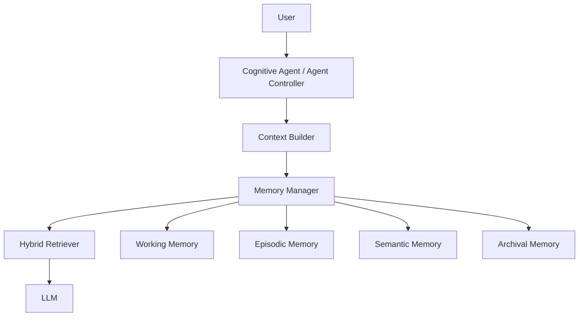

# Cognitive Memory Engine for LLM Agents

This project implements a memory-augmented LLM system inspired by MemGPT to overcome context window limitations through hierarchical memory management.

## 1. Problem

Large language models fail when the required context exceeds prompt limits. This causes:

- loss of long-term conversation continuity
- weak recall of old but important facts
- degraded long-document reasoning quality

The goal of this project is to provide a production-oriented memory architecture that externalizes memory while preserving coherent reasoning.

## 2. Research Background

The design follows principles from MemGPT-style systems:

- explicit memory tiers instead of one flat vector store
- agent-managed memory lifecycle (write, summarize, merge, prune)
- context selection using relevance, recency, and importance

Core equation used in this implementation:

```text
score = 0.5 * relevance + 0.3 * recency + 0.2 * importance
```

## 3. Architecture

### Architecture Diagram



### Memory Modules

- `memory/working_memory.py`
- `memory/episodic_memory.py`
- `memory/semantic_memory.py`
- `memory/archival_memory.py`
- `memory/memory_consolidation.py`

### Context Modules

- `context/context_builder.py`
- `context/context_ranker.py`
- `context/token_budget.py`

## 4. Algorithms

Implemented algorithms include:

- hybrid retrieval: vector + keyword + recency + importance + graph boost
- query rewriting for acronym expansion (`RAG`, `LLM`, etc.)
- token-budget-aware prompt assembly
- recursive long-context compression for very large documents
- memory consolidation lifecycle:
  - summarize old memory
  - merge redundant memory
  - prune low-importance memory

## 5. Evaluation

Evaluation modules:

- `evaluation/long_conversation_test.py`
- `evaluation/long_document_qa.py`
- `evaluation/benchmarks.py`

Supported benchmark scenarios:

- 100k-token-scale long document QA (compressed pipeline)
- 500-turn long conversation recall evaluation
- knowledge recall after persistent storage

Current repository status:

- tests: `23 passed`
- coverage: `>= 80%` target maintained

## 6. Demo

Setup:

```bash
python -m pip install -e .[dev]
```

Run tests:

```bash
python -m pytest -q
```

Run demo:

```bash
python -m experiments.run_demo
```

Run API:

```bash
uvicorn api.app:app --reload
```

Key endpoints:

- `GET /health`
- `POST /memory/write`
- `GET /memory/search`
- `POST /document/ingest`
- `POST /chat`
- `POST /memory/consolidate`
- `GET /session/history`
- `GET /benchmark/quick`

